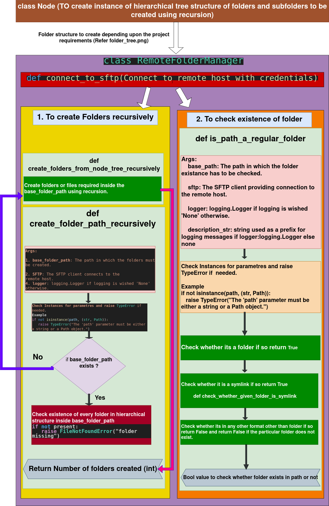

# Task- 1
Create folders in the given folder path on remote host recursively

# Task- 2
Check existance of folder

# Class Node - Task-1
When creating folder structures for different projects the number of folders, subfolders and the hierarchy of subfolders may vary. To handle this
dynamically depending upon the requirement, the concept of **nodes** is implemented in **class Node** in **Plus4Data.py** file.

The folder tree architecture implemented in this code for Task-1 to create folders recursively is shown below.

  

The same **class Node** can be used for any dynamic folder structure creation.

The architecture for task 1 and task 2 that has been implemented is shown  below visually.

  

**Steps to execute**\
1. `git clone repo`
2. `Pip install requirements.txt`
3. python 3 main.py
